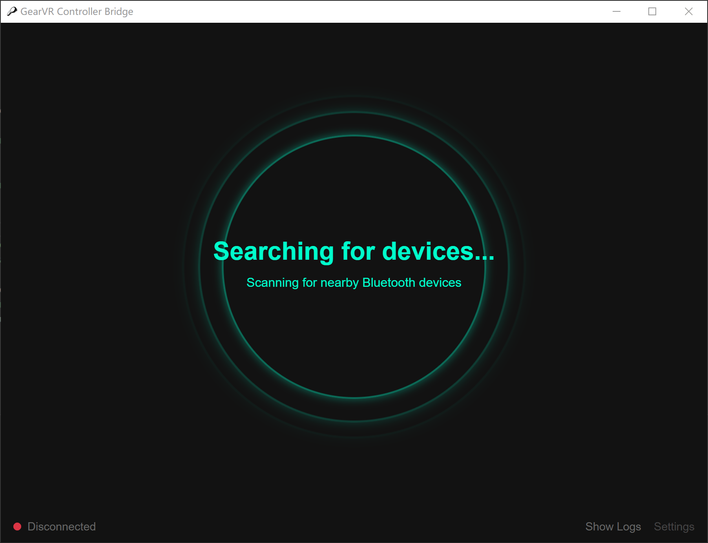
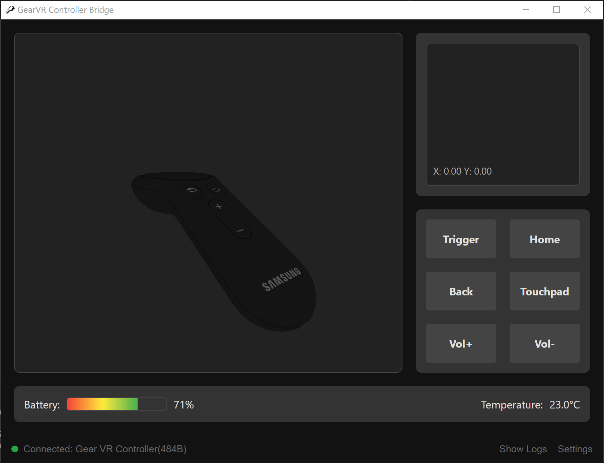
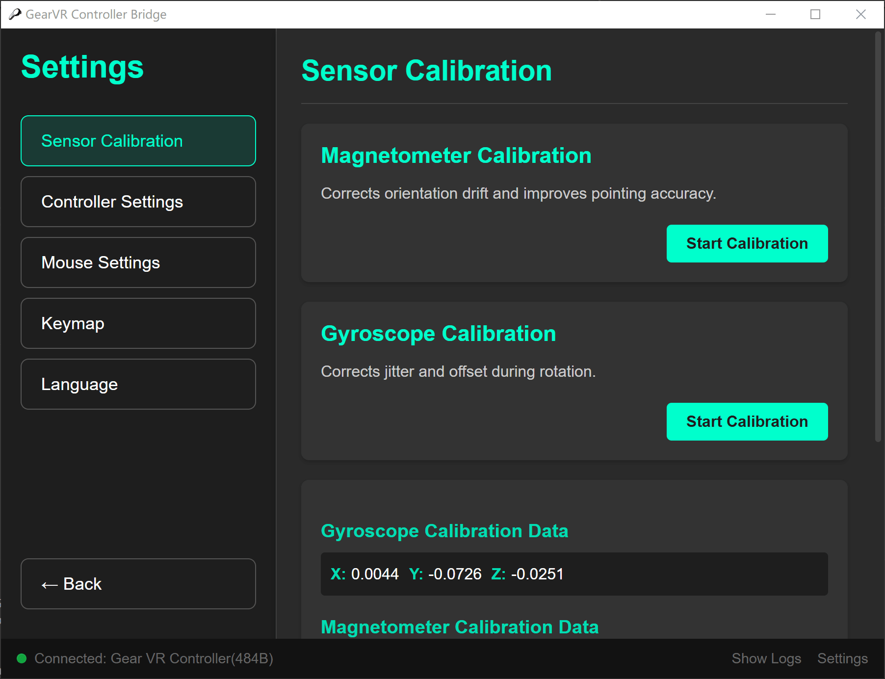

# GearVR Controller Bridge

<div>A tool that uses the Samsung Gear VR controller to simulate mouse and keyboard input.</div>




## Features

*   **Mouse Simulation**:
    *   **Air Mouse**: Uses the controller's orientation sensor to move the mouse.
    *   **High-Precision Mode**: When your finger touches the touchpad, it automatically switches to high-precision mode for precise pointing.
    *   **Touchpad Mode**: Uses the controller's touchpad to move the mouse.
    *   **Quick Mode Switching**: You can switch between Air Mouse and Touchpad modes by quickly double-clicking the Home button.
*   **Keyboard Simulation**:
    *   **Custom Key-mapping**: Map the controller's buttons (Trigger, Home, Back, Volume) to any key on the keyboard.
*   **Connection Management**:
    *   **Auto-Connect**: Automatically connects to the controller on startup.
    *   **Auto-Reconnect**: After disconnection, press any key to automatically try to reconnect.
    *   **Device Standby**: Supports the controller automatically entering standby mode to save power.

## Supported Platforms

*   Windows 10 and later
*   macOS

**Note for macOS users:** If you see a message saying the app "is damaged and can’t be opened", you may need to run the following command in the terminal:
```bash
xattr -cr "/Applications/GearVR Controller Bridge.app"
```
This is because the application is not signed.

## How to Use

1.  Make sure your computer's Bluetooth is turned on.
2.  Open the application.
3.  Press and hold the `Home` button on your Gear VR controller until the indicator light starts flashing to enter pairing mode.
4.  The application will automatically search for and connect to the controller.
5.  Once connected, you can start using the controller to control your computer.
6.  When using for the first time, please calibrate the magnetometer and gyroscope on the "Settings" page.
7.  In the "Settings" page, you can customize key mappings, mouse sensitivity, and more.

## Thanks

Thanks to [gearvr-controller-webbluetooth](https://github.com/jsyang/gearvr-controller-webbluetooth) and [gearVRC](https://github.com/uutzinger/gearVRC) for the inspiration.
