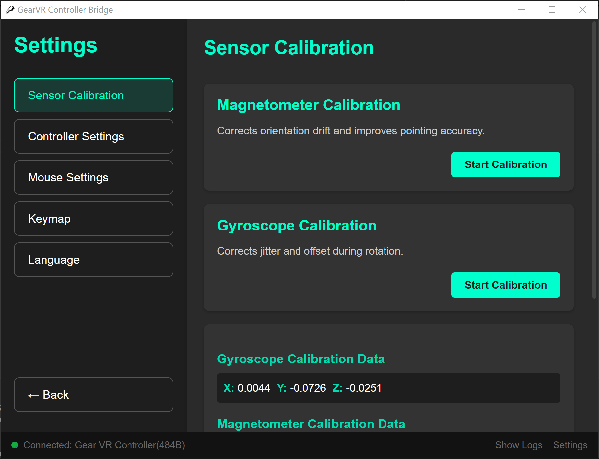

# GearVR Controller Bridge

<div>一个使用三星 Gear VR 控制器来模拟鼠标和键盘输入的工具。</div>




## 功能

*   **鼠标模拟**:
    *   **Air Mouse**: 使用控制器的姿态传感器来移动鼠标。
    *   **高精度模式**: 当手指触摸触摸板时，自动切换高精度模式，实现精准指向。
    *   **触摸板模式**: 使用控制器上的触摸板来移动鼠标。
    *   **快速模式切换**: 可以通过快速双击Home按键在 Air Mouse 和触摸板模式之间切换。
*   **键盘模拟**:
    *   **自定义按键映射**: 可以将控制器的按键（扳机键、主页键、返回键、音量键）映射到键盘上的任意按键。
*   **连接管理**:
    *   **自动连接**: 启动时自动连接到控制器。
    *   **自动重连**: 在连接断开后，按任意键自动尝试重新连接。
    *   **设备待机**: 支持控制器自动进入待机模式以节省电量。

## 支持的平台

*   Windows 10 及更高版本
*   macOS

**macOS 用户请注意：** 如果您看到提示“应用已损坏，无法打开”，您可能需要在终端中运行以下命令：
```bash
xattr -cr "/Applications/GearVR Controller Bridge.app"
```
这是因为该应用程序没有签名。

## 如何使用

1.  确保您的电脑蓝牙已开启。
2.  打开应用。
3.  按住 Gear VR 控制器上的 `Home` 键，直到控制器指示灯开始闪烁，进入配对模式。
4.  应用会自动搜索，并连接控制器。
5.  连接成功后，您就可以开始使用控制器来控制您的电脑了。
6.  首次使用时，请在“设置”页面校准磁力计和陀螺仪。
7.  在“设置”页面，您可以自定义按键映射和鼠标灵敏度等。

## 感谢

感谢 [gearvr-controller-webbluetooth](https://github.com/jsyang/gearvr-controller-webbluetooth) 与 [gearVRC](https://github.com/uutzinger/gearVRC) 给于的灵感和启发。